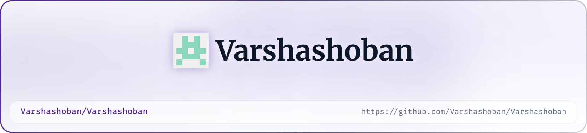

<!-- ═══════════════════════════════════════════════════════════════ -->

<!--                    GITHUB PROFILE README                       -->

<!-- ═══════════════════════════════════════════════════════════════ -->

<!-- 🌸 Responsive Light / Dark Banner -->

  <picture>
    
    <source media="(prefers-color-scheme: dark)" srcset="./art/header-dark.png">
    <source media="(prefers-color-scheme: light)" srcset="./art/header-light.png">
    
  </picture>

    
  </picture>

 

<!-- 👋 Hero Section -->

<h1 align="center">
  Hey there, I'm Varsha 👋
</h1>

  

  
  
  

 

---

<!-- ═══════════════════════════════════════════════════════════════ -->

<!--                         ABOUT ME                               -->

<!-- ═══════════════════════════════════════════════════════════════ -->

<h2 align="center">🌸 About Me</h2>

<table align="center">
  <tr>
    <td width="65%" valign="middle">

### 👩‍💻 Who Am I?

* 🎓 I'm a **B.Tech CSE Core student at VIT Chennai**
* 💻 Passionate about **Full-Stack Development, Cloud Computing, DevOps, and AI**
* ☁️ Exploring **AWS, Docker, cloud architecture, and AI infrastructure**
* 🤖 Interested in **AI systems, AI agents, and intelligent automation**
* 🚀 I enjoy turning ideas into **practical, deployable projects**
* 🔬 Exploring **research, intelligent systems, and emerging technologies**
* 🌱 Currently learning **AWS, Docker, Kubernetes, DevOps, AI Agents, and Cloud Architecture**
* 🤝 Open to **collaborations, research, hackathons, internships & open source**
* ⚡ Fun fact: **I enjoy building things more than just talking about them.**

 

> *"Building, learning, breaking, fixing, and building again."* 🚀

</td>

<td width="35%" align="center">

  

</td>
  </tr>
</table>

 

---

<!-- ═══════════════════════════════════════════════════════════════ -->

<!--                       EXPERIENCE                               -->

<!-- ═══════════════════════════════════════════════════════════════ -->

<h2 align="center">💼 Experience</h2>

### Sonata Software — AI Infrastructure Intern

Worked on **AI infrastructure, cloud-related technologies, networking, and migration planning** during my internship.

**Worked with**

`Java Spring Boot` `ASPX` `Microsoft 365` `Google Workspace` `Networking` `Hyper-V`

Contributed to a **Microsoft 365 → Google Workspace migration planning tool**, including estimating migration time for emails, contacts, calendars, and events across multiple batches.

 

---

<!-- ═══════════════════════════════════════════════════════════════ -->

<!--                       TECH STACK                               -->

<!-- ═══════════════════════════════════════════════════════════════ -->

<h2 align="center">🛠️ Tech Stack</h2>

  <i>Technologies I use, explore, and build with</i>

 

<h3 align="center">💻 Languages</h3>

  

<h3 align="center">⚛️ Frontend & Backend</h3>

  

<h3 align="center">☁️ Cloud, DevOps & Infrastructure</h3>

  

<h3 align="center">🗄️ Databases & Tools</h3>

  

 

---

<!-- ═══════════════════════════════════════════════════════════════ -->

<!--                      FEATURED PROJECTS                          -->

<!-- ═══════════════════════════════════════════════════════════════ -->

<h2 align="center">🚀 Featured Projects</h2>

<table align="center">
  <tr>
    <td width="50%" valign="top">

### 🌸 HabitFlow

**Full-Stack Habit Tracking Application**

A full-stack habit tracking platform designed to help users build and maintain consistent habits.

**Stack**

`React` `Vite` `Tailwind CSS` `Node.js` `Express.js` `MongoDB Atlas` `JWT`

  
  

</td>

<td width="50%" valign="top">

### 🤖 SyncStep

**AI Human Movement Analysis & Coaching System**

An AI-powered system for analyzing human movement and providing intelligent coaching using computer vision and pose estimation.

**Stack**

`Python` `OpenCV` `MediaPipe` `MoveNet` `TensorFlow Lite` `Flask`

**My Role:** Human Pose Estimation

  
  

</td>
  </tr>
</table>

 

---

<!-- ═══════════════════════════════════════════════════════════════ -->

<!--                  RESEARCH & INTERESTS                          -->

<!-- ═══════════════════════════════════════════════════════════════ -->

<h2 align="center">🔬 Research & Interests</h2>

  🤖 Artificial Intelligence & AI Agents &nbsp; • &nbsp;
  ☁️ Cloud Computing &nbsp; • &nbsp;
  ⚙️ DevOps & AIOps

  🌐 Full-Stack Development &nbsp; • &nbsp;
  🧠 Intelligent Automation &nbsp; • &nbsp;
  🔐 Cybersecurity & Fraud Detection

  📊 Distributed Systems &nbsp; • &nbsp;
  🔬 Applied Computer Science Research

 

---

<!-- ═══════════════════════════════════════════════════════════════ -->

<!--                     CURRENTLY LEARNING                         -->

<!-- ═══════════════════════════════════════════════════════════════ -->

<h2 align="center">📚 Currently Learning</h2>

  
  
  
  

  
  
  
  

 

---

<!-- ═══════════════════════════════════════════════════════════════ -->

<!--                       GITHUB STATS                             -->

<!-- ═══════════════════════════════════════════════════════════════ -->

<h2 align="center">📊 GitHub Analytics</h2>

  

 

<!-- 🔥 GitHub Streak -->

<h2 align="center">🔥 GitHub Streak</h2>

  

 

<!-- 📈 Activity Graph -->

<h2 align="center">📈 Contribution Activity</h2>

  

 

---

<!-- ═══════════════════════════════════════════════════════════════ -->

<!--                      CONTRIBUTION SNAKE                         -->

<!-- ═══════════════════════════════════════════════════════════════ -->

<h2 align="center">🐍 Contribution Snake</h2>

  

<!--
GitHub Action for Contribution Snake

Create:
.github/workflows/snake.yml

Example:

name: Generate Contribution Snake

on:
  schedule:
    - cron: "0 0 * * *"
  workflow_dispatch:

jobs:
  generate:
    runs-on: ubuntu-latest
    steps:
      - uses: Platane/snk@v3
        with:
          github_user_name: ${{ github.repository_owner }}
          outputs: |
            dist/github-contribution-grid-snake.svg
            dist/github-contribution-grid-snake-dark.svg?palette=github-dark

      - uses: crazy-max/ghaction-github-pages@v4
        with:
          build_dir: dist
        env:
          GH_PAT: ${{ secrets.GITHUB_TOKEN }}
-->

 

---

<!-- ═══════════════════════════════════════════════════════════════ -->

<!--                         CONNECT                                -->

<!-- ═══════════════════════════════════════════════════════════════ -->

<h2 align="center">💌 Let's Connect</h2>

  

  

 

  <i>Open to collaborations, opportunities, research, and interesting ideas. 🌷</i>

 

---

<!-- ═══════════════════════════════════════════════════════════════ -->

<!--                         FOOTER                                 -->

<!-- ═══════════════════════════════════════════════════════════════ -->

  

  <b>Thanks for visiting my profile! 💗</b>

  ⭐ Explore my repositories • 💬 Say hello • 🤝 Let's build something amazing

